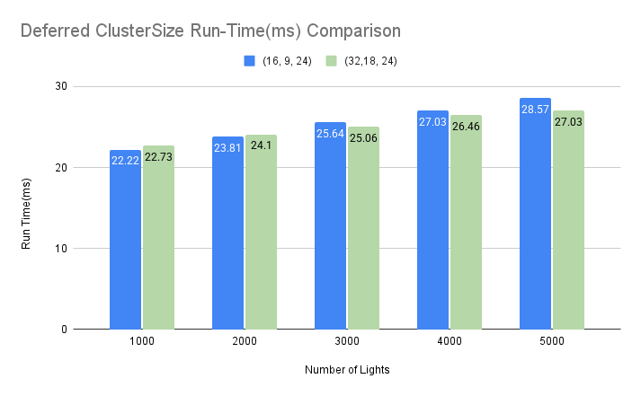
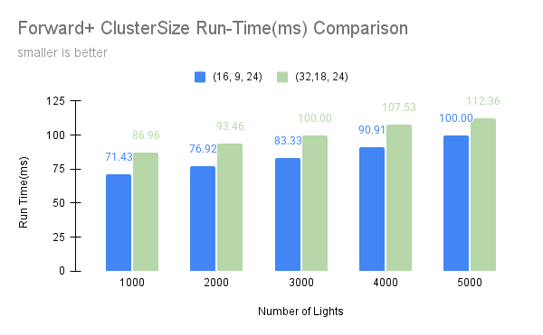
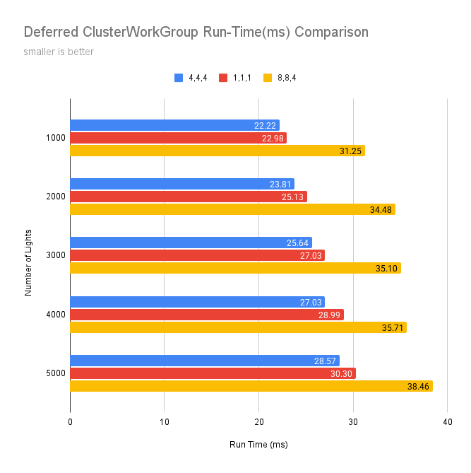

WebGL Forward+ and Clustered Deferred Shading
======================

**University of Pennsylvania, CIS 565: GPU Programming and Architecture, Project 4**

* Caroline Fernandes
* Tested on: **Google Chrome Version 141.0.7390.77** on
  Windows 11, i9-14900HX @ 2.20GHz, Nvidia GeForce RTX 4070

### Live Demo

### Demo Video/GIF

[Demo Video](https://vimeo.com/1128505371?share=copy&fl=sv&fe=ci#t=24)

### Overview
This project introduced me to WebGPU and the concepts of clustered deferred rendering. I implemented three versions including naive, forward +, and deferred shading.
The base code provided gltf loading, camera controls, light movement compute shader, naive forward renderer, and skeleton code for the other two renderers.

Camera controls:

Rotation: left click + drag

Zoom: scroll wheel/track pad

### Naive

The Naive version takes in the model's vertex data and loops over all of the lights in the scene to calculate their individual contributions. As the scene scales and the number of lights increases, it makes sense that this implementation performs the worst.

### Forward+

Forward+ is an improvement to traditional forward rendering, which I have implemented by partitioning the scene into clusters. The clustering shader calculates the clusters and assigns lights to each, and the fragment shader determines the cluster and calculates the light based on the specific cluster's lights. This method for rendering has become more popular as it allows optimization to come from pre-processing while still benefiting from a forward pipeline. A further optimization could be computing a depth pre-pass.

### Deferred

For this implementation, I leveraged the clustering compute shader again. The main workflow is separated into two passes: a geometry pass and a lighting pass. The first writes position, albedo, and normal data to G-buffers. The second pass is responsible for collecting the lights data for the specific cluster and computing the lighting with the G-buffer information. Further optimizations could include compressing the g-buffers to reduce memory bandwidth or utlizing shared memory from moving the lighting computation to a compute pass.

## Performance Analysis

The baseline for my tests used a clusterWorkGroup of [4,4,4] and a clusterScale of [16, 9, 24]

**Forward+ vs. Clustered Deferred**
Even with less lights, the deferred implementation outperforms the forward+ pipeline for the indoor Sponza scene.

Forward+ is more optimal for transparent materials, as it keeps the geometry and lighting together in the same render pass. Deferred is better for highly detailed scenes with many lights, 

Compared to deferred rendering, forward+ stores less data and requires less memory which is a benefit in realtime. 
Deferred allows you to separate out the geometry from the lighting information allowing more flexibility, it is more scalable as well. However in deferred rendering you can only render what is visible to the camera, you won't have the typical scene information of things not visible to camera which is most visible in reflections. In order to implement transparency, a deferred pipeline would need to save out more data to g-buffers.

The overhead of preprocessing in a Forward+ pipeline is not a huge benefit for super dense scenes like Sponza, and forward+ will calculate the lighting for a single pixel multiple times. Deferred rendering will only calculate the lighting once per pixel because it has knowledge of the visible geometry.

# Cluster Size
I also tested out alternatives to the number of clusters generated. In a deferred pipeline, it seemed scenes with more lights benefited from more clusters. However, this was not true for a forward+ pipeline.

# Workgroup Size
A workgroup size of [4,4,4] seemed to be the most performant for a deferred pipeline.

  
I was hoping to utilize timestamp-queries to profile but I had trouble getting it to work, I was getting errors saying my gpu was uncompatible.
I also profiled using the extension's capture, and while it was interesting it was not a reliably consistent comparision for my purposes.

### Credits

- [Vite](https://vitejs.dev/)
- [loaders.gl](https://loaders.gl/)
- [dat.GUI](https://github.com/dataarts/dat.gui)
- [stats.js](https://github.com/mrdoob/stats.js)
- [wgpu-matrix](https://github.com/greggman/wgpu-matrix)
