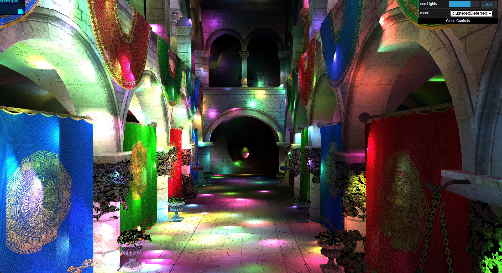
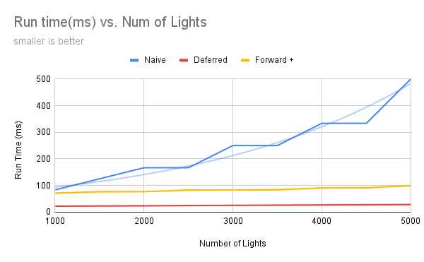
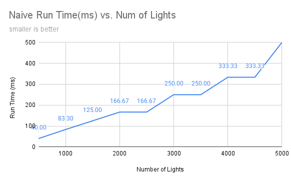
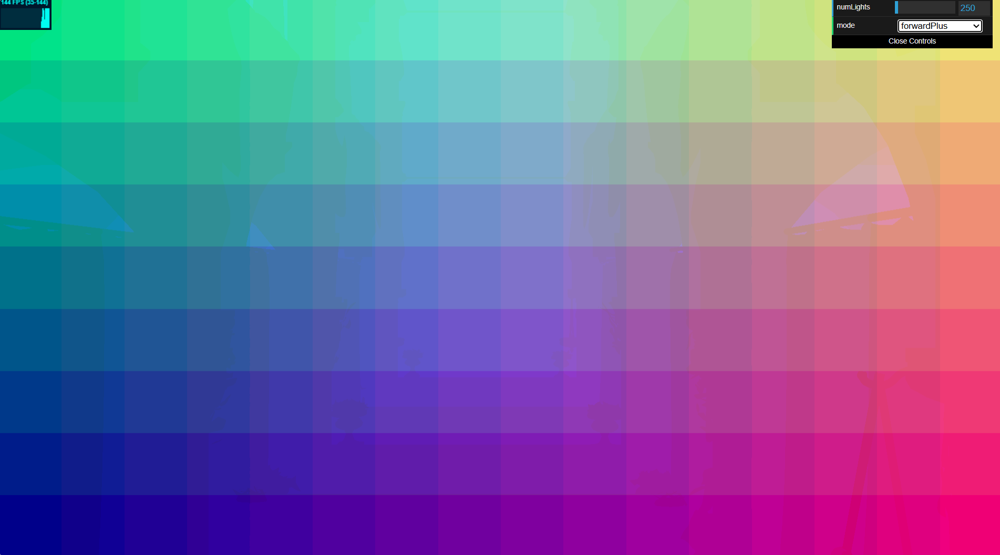
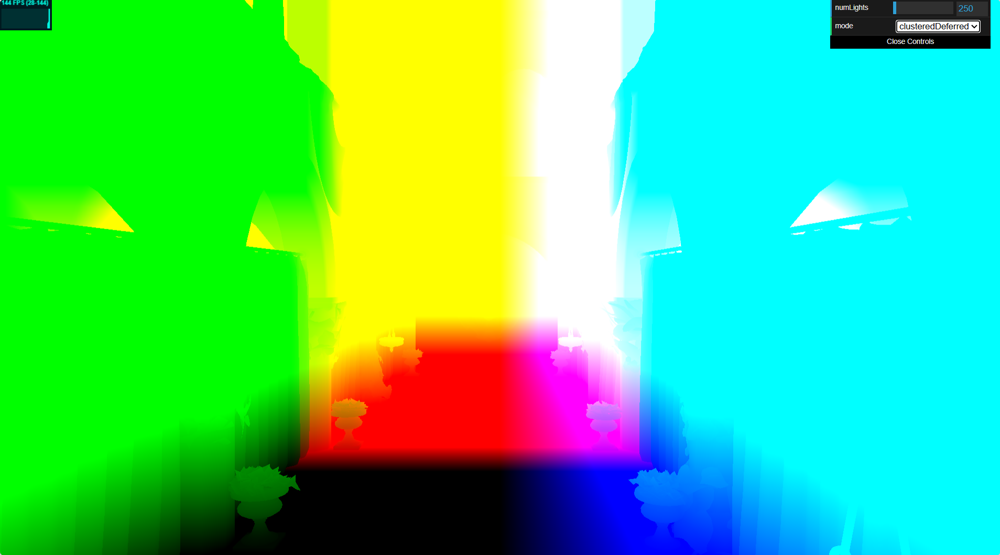
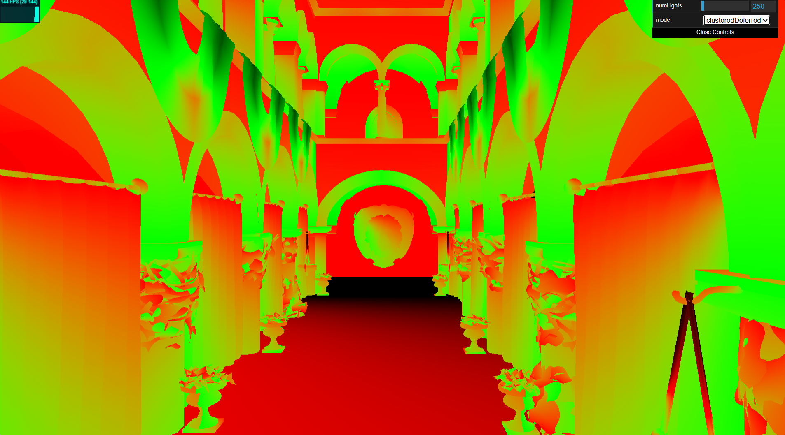
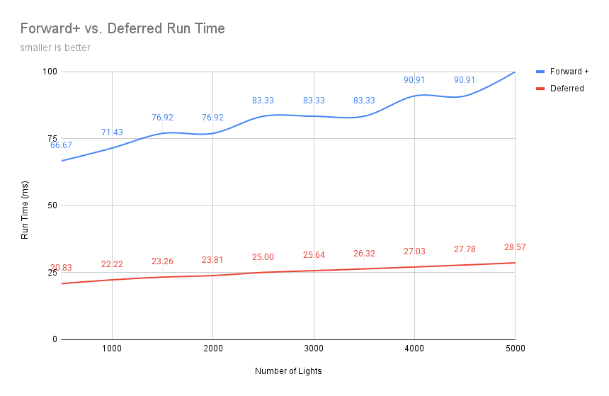
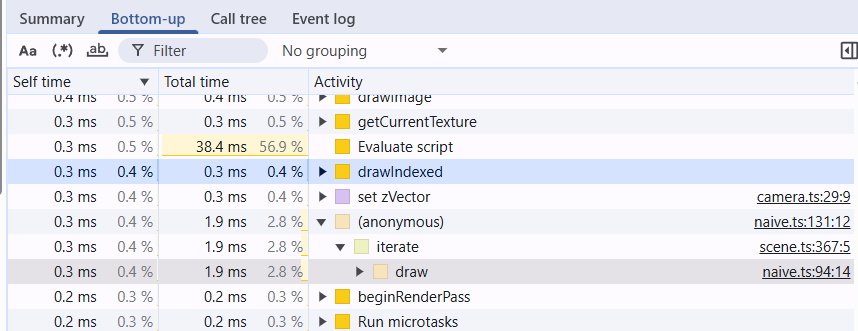

WebGL Forward+ and Clustered Deferred Shading
======================

**University of Pennsylvania, CIS 565: GPU Programming and Architecture, Project 4**

* Caroline Fernandes
* Tested on: **Google Chrome Version 141.0.7390.77** on
  Windows 11, i9-14900HX @ 2.20GHz, Nvidia GeForce RTX 4070

### Live Demo

### Demo Video/GIF

### (Overview)
This project introduced me to WebGPU and the concepts of clustered deferred rendering. I implemented three versions including naive, forward +, and deferred shading.
The base code provided gltf loading, camera controls, light movement compute shader, naive forward renderer, and skeleton code for the other two renderers.

Camera controls:

Rotation: left click + drag

Zoom: scroll wheel/track pad

### (Naive)

The Naive version takes in the model's vertex data and loops over all of the lights in the scene to calculate their individual contributions. As the scene scales and the number of lights increases, it makes sense that this implementation performs the worst.

### (Forward+)

Forward+ is an improvement to traditional forward rendering, which I have implemented by partitioning the scene into clusters. The clustering compute shader calculates the clusters and assigns lights to each. The fragment then determines which cluster to access and then calculates the light based on the specific cluster's lights. This method for rendering has become more popular as it allows optimization to come from pre-processing while still benefiting from a forward pipeline.

### (Deferred)

For this implementation, I leveraged clustering again and separated the geometry from the lights storing data in G-buffers. It is separated into two passes a geometry pass and a lighting pass, the first writes position, albedo, and normal data to G-buffers. The second pass is responsible for collecting the lights data for the specific cluster and computing the lighting with the G-buffer information.

### (Performance Analysis)
The baseline for my tests used a clusterWorkGroup of [4,4,4] and a clusterScale of [16, 9, 24]
Forward+ vs. Clustered Deferred
The deferred implementation is faster than the forward+ pipeline.

Is one of them better at certain types of workloads?
What are the benefits and tradeoffs of using one over the other?
For any differences in performance, briefly explain what may be causing the difference.

I was hoping to utilize timestamp-queries to profile but I had trouble getting it to work, I was getting errors saying my gpu was uncompatible.
I also profiled using the extension's capture, and while it was interesting it was not a reliably consistent comparision for my purposes.

### Credits

- [Vite](https://vitejs.dev/)
- [loaders.gl](https://loaders.gl/)
- [dat.GUI](https://github.com/dataarts/dat.gui)
- [stats.js](https://github.com/mrdoob/stats.js)
- [wgpu-matrix](https://github.com/greggman/wgpu-matrix)
